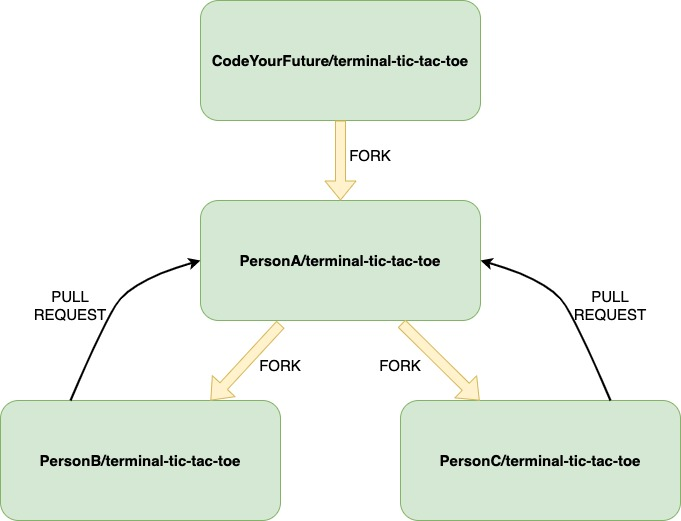

# TIC-TAC-TOE in the terminal!
This is a small project that can be worked on in a group of 3 people. Once completed, you will have a working version of tic-tac-toe which you can play right in your terminal!

## Instructions
1. Select one person in the group (PersonA) to fork this repo.
2. After this, the other 2 people in the group (PersonB and PersonC) can fork PersonA's repo (if this is confusing, see the diagram below).
3. Now all 3 people can clone their fork.
4. The first thing you need to do is run `npm install` in the project directory.
5. Inside the repo, there are a few functions which, as a team, you will need to implement. They are divided into the following 3 files:
    - `board-printer.js`
    - `move-maker.js`
    - `status-checker.js`
Assign a different file to each person in the group to work on.
You will also notice a file called `play.js` which you can leave unchanged.
6. Each person in the group can now implement the function(s) in their file. Follow the requirements for the function carefully so you know what to implement. Feel free to discuss any problems or questions with each other - you're a team, and you can work together.
7. When you've completed work on your file - raise a Pull Request against PersonA's fork. You can review the changes as a team and merge them in. Make sure each person in the group understands the changes!
8. When all the changes are in one fork, you can run the game with `node play.js`. Don't worry if it doesn't work perfectly the first time - try and fix any problems you find.
9. After fixing any bugs, you should have a working version of tic-tac-toe running in your terminal :)

